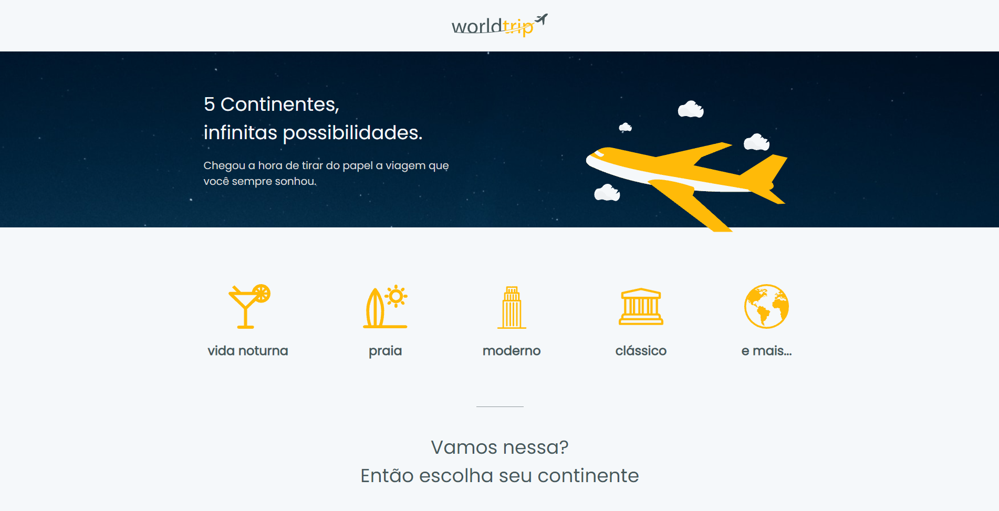

  
  
  

 

  

<h3 align="center">
  Desafio 07 - Trilha ReactJS
</h2>

	Resolução do Desafio "Interface com Chakra UI"

## Sobre o desafio

  

Nesse desafio, você deverá criar uma aplicação para treinar o que aprendeu até agora no ReactJS

Essa será uma aplicação onde você tem dois objetivos principais. O primeiro é desenvolver toda a interface usando como base o Chakra UI. O outro é que você deve trabalhar o responsivo da aplicação (e é aqui que sua criatividade pode brilhar ainda mais).

Você vai iniciar uma aplicação Next.js do zero na sua própria máquina e implementar a interface conforme o layout do Figma.

## Status do desafio

✅ Completo
